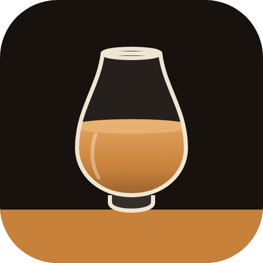

  

<h1 align="center">Whisky Vault</h1>

  <b>Das private Archiv für deine Whisky-Sammlung.</b> 
  Flaschen erfassen, Abende bewerten, Käufe planen und mit Freunden teilen. Alles in einer App, auf jedem Gerät.

---

## Warum Whisky Vault?

Wer ein paar Flaschen mehr im Schrank hat, kennt es: Was habe ich schon? Wie viel ist noch drin? Was hat mir am Degustationsabend eigentlich geschmeckt? Und was kostet die Flasche heute?

Whisky Vault beantwortet das in Sekunden. Flasche scannen oder Namen eintippen, Daten und Bild kommen automatisch, den Rest ergänzt du mit zwei Handgriffen.

## Das kann die App

### Sammlung
- Jede Flasche mit Bild, Brennerei, Region, Fassart, Abfüller, Alter, Alkoholgehalt, Inhalt und Notizen.
- **Status** geöffnet oder ungeöffnet, dazu der **Füllstand** als Regler, damit du siehst, was fast leer ist.
- Kaufdatum und Kaufort für dich privat festhalten.
- Filter nach geöffnet, ungeöffnet, fast leer, ohne Note und ohne Marktpreis.
- Ansicht als **Karten mit Bild** oder als **kompakte Liste ohne Bilder**, die App merkt sich deine Wahl.
- Übersicht mit Anzahl Flaschen, Einstandswert, Marktwert und Durchschnittsnote.
- Suchen, nach Name, Brennerei, Note, Preis, Füllstand oder Datum sortieren, **Backup als JSON** oder **CSV** exportieren.
- **Statistik:** Inhalt und Restmenge, Top-Brennereien, Regionen, Geschmacksprofil, Ausgaben pro Jahr, beste Bewertungen sowie grösster Wertzuwachs und -verlust.

### Schnell erfassen
- **Barcode scannen** mit der Rückkamera des Handys (bei mehreren Kameras wählbar), oder ein Foto vom Strichcode machen.
- **Online-Abgleich** nach Name oder Barcode über mehrere Datenbanken. Treffer übernimmt die App samt Bild, Marke, Alkoholgehalt und Inhalt.
- Schreibweisen wie «Glenmoray» und «Glen Moray» findet die Suche beide.
- **Bild ausrichten:** verschieben und zoomen, bis das Etikett perfekt im Rahmen sitzt.

### Degustation
- Abende anlegen und jeden Whisky bewerten: **Punkte von 0 bis 100**, Nase, Gaumen, Abgang.
- Geschmacksrichtungen per Tipp wählen: rauchig, torfig, fruchtig, süss, würzig, Sherry und mehr.
- Du hältst fest, ob du ihn kaufen würdest, und siehst am Ende, was dir geschmeckt hat.
- Bewertete Whiskys übernimmst du mit einem Tipp in die Sammlung.
- **Liste scannen:** Das Blatt mit den Whiskys des Abends fotografieren, die App liest die Namen, du prüfst die Liste und fügst alle auf einmal ein, auf Wunsch mit Bild und Daten aus dem Netz.
- **Degustation teilen:** Einer erfasst alle Whiskys und teilt die Degustation per **QR-Code** oder Link. Die anderen treten per Scan bei und sehen alle Whiskys, neue kommen automatisch dazu. Bewertungen bleiben bei jedem privat.

### Kaufliste und Preise
- Eigene **Wunschliste** mit Zielpreis, zuletzt gesehenem Preis und Priorität. Die App zeigt an, wenn der Zielpreis erreicht ist, und übernimmt den Wunsch mit einem Tipp in die Sammlung.
- Auch die Flaschen von Freunden lassen sich mit einem Tipp auf die Wunschliste setzen.
- Whiskys, bei denen du am Degustationsabend «Ja» oder «Vielleicht» wählst, landen automatisch auf der Kaufliste, sortiert nach deiner Note.
- **Preisvergleich** mit einem Tipp: Google Shopping, toppreise.ch, idealo.de und Whiskybase, mit Marke und Name schon eingesetzt.
- Community-Preise (Open Prices) per Barcode, den besten Marktpreis trägst du ein.
- In der Sammlung siehst du auf einen Blick, ob eine Flasche seit dem Kauf im Wert gestiegen oder gefallen ist.

### Freunde
- Teile deine Sammlung per **Freundescode**, ohne E-Mail-Adressen auszutauschen.
- Freunde sehen Name, Bild, Füllstand, Note und Notizen.
- **Preise, Degustationen und Kaufliste bleiben immer privat.**
- Ein Schalter sperrt die Freigabe sofort.
- **Benachrichtigungen:** Die Glocke zeigt Anfragen, Einladungen und neue Whiskys deiner Freunde. Jede Art lässt sich einzeln ausschalten. Auf Wunsch kommen sie auch als Push bei geschlossener App.
- Freunde lassen sich direkt in eine gemeinsame Degustation einladen.

### Auf jedem Gerät
- **Anmeldung** mit E-Mail und Passwort oder mit Google. Deine Daten sind in der Cloud und auf allen Geräten gleich.
- **Als App installierbar:** auf dem Handy «Zum Home-Bildschirm» wählen, und Whisky Vault startet wie eine App.
- **Offline nutzbar:** Änderungen ohne Netz werden zwischengespeichert und später synchronisiert.
- Dunkles Design im Fassholz-Look mit Kupferakzent.
- **Änderungsprotokoll:** Nach einem Update zeigt die App einmal, was neu ist. Die neueste Version steht oben, frühere Versionen lassen sich durchblättern.

## Unter der Haube

- Eine einzige Seite (`index.html`), kein Build-Schritt, kein eigener Server.
- Konto und Datenbank über Firebase (Authentication und Firestore).
- Produktdaten von Open Food Facts, UPCitemdb und Wikidata, Preise von Open Prices.
- Läuft auf GitHub Pages.

## Datenschutz

Deine Sammlung gehört dir. Einstandspreise, Marktpreise, Degustationen und die Kaufliste sind nur für dich sichtbar. Freunde sehen nur, was du bewusst freigibst, und nur, wenn du die Freigabe eingeschaltet lässt. Über «Alle meine Whisky-Daten löschen» im Tab **Konto** entfernst du Flaschen, Degustationen und Freigaben jederzeit.
